# Test case level 1

## TC 1


## TC 2


## TC 3


## TC 4


## TC 5


## TC 6


## TC 7


## TC 8


## TC 9


## TC 10


# Test case level 2

## TC 11


## TC 12


## TC 13


## TC 14


## TC 15


## TC 16


## TC 17


## TC 18


## TC 19


## TC 20


# Test case level 3

## TC 21


## TC 22


## TC 23


## TC 24


## TC 25


docker exec cab_kafka kafka-console-consumer --bootstrap-server localhost:9092 --topic BookingCreated --from-beginning --max-messages 1


## TC 26


## TC 27


## TC 28


## TC 29


## TC 30
Lần 1 và lần 2


Lần 3


Tắt pricing-service

Giá vẫn được tính trong khoảng 8->25


# Test case level 4
## TC 31


## TC 32


## TC 33
Tạo 1 booking mới


Kích hoạt lỗi số tiền âm


Kiểm tra kết quả Rollback tại Booking Service


## TC 34
Gửi yêu cầu đặt xe Lần 1 (Kèm Key duy nhất)


Gửi lại y hệt yêu cầu đó Lần 2 (Giả lập bấm nhầm 2 lần)


## TC 35
Chuẩn bị lệnh gửi đồng thời (Concurrent Request)
Đổi token


Ko cho tạo đồng thời


## TC 36
Tạo 1 booking mới (ví dụ đang có id là 30)


Thanh toán thành công (lấy cái id của booking vừa tạo)


Chuyển từ request sang paid


## TC 37
Tạo booking mới


Giả lập lỗi Thanh toán (Simulate Failure)


Kiểm tra kết quả Rollback tại Booking Service (Trạng thái trả về là 'failed')


## TC 38
DB commit và Kafka event đồng bộ và giải thích
node test-outbox.js


## TC 39
Partial failure (network issue)
Client bị mất mạng (Timeout 5ms) và không nhận được phản hồi từ Payment Service.
Nhưng phía Server, Payment Service vẫn tiếp tục xử lý bình thường và hoàn tất việc thanh toán.
Sau 1 giây kiểm tra lại, Booking đã tự động chuyển từ REQUESTED → PAID nhờ Saga Event từ Kafka.
Không có "inconsistent state", không có "kẹt" transaction.

node test-network-failure.js


## TC 40
Test Case 40 là bài test tổng hợp về ACID - Atomicity, Consistency, Isolation và Durability, kiểm tra cả 4 tính chất cùng lúc.

node test-acid.js


# Test case level 5
Kiến trúc em dùng là Generative AI (LLM-based) kết hợp Traditional ML làm fallback thay vì rule-based hardcode (nếu hết request)

ai-service → Gọi Gemini 2.5 Flash Lite cho mọi task (ETA, Fraud, Pricing, Dispatch)

Cách hoạt động: Mỗi request → gửi prompt → Gemini lý luận → trả kết quả.

=> Dùng AI để suy luận thay vì phải training toàn bộ cần tệp dữ liệu

Phương pháp Traditional ML Pipeline:
ml-training-service   → Train mô hình (scikit-learn / TensorFlow / PyTorch)
model-serving-service → Serve mô hình đã train (ONNX / TF Serving)
ai-eta-service        → Chạy model ETA đã train
ai-matching-service   → Chạy model ghép driver-rider
ai-surge-service      → Chạy model dự báo surge


## TC 41
node test-ai-eta.js


## TC 42 
Kiểm tra khả năng điều chỉnh giá linh hoạt của AI dựa trên cung cầu và môi trường.

node test-ai-surge.js

**Kịch bản kiểm thử:**
1. **Ngày bình thường:** Nhu cầu thấp, nhiều tài xế -> Surge = 1.0x.
2. **Giờ cao điểm:** Nhu cầu cao, ít tài xế -> Surge > 1.5x.
3. **Trời mưa:** Nhu cầu cao + thời tiết xấu -> Surge > 2.0x (nhưng < 3.0x).

**Kết quả kỳ vọng:**
- AI trả về đúng hệ số nhân giá (Surge Multiplier) theo thời gian thực.
- Có giải thích logic (`reasoning`) cho từng quyết định tăng giá.

**Minh chứng:**


## TC 43

node test-ai-fraud.js


## TC 44 - AI Driver Recommendation Validation
Kiểm tra khả năng thông minh của AI trong việc chọn lọc tài xế tốt nhất cho khách hàng.

node test-ai-recommend.js

**Kết quả kỳ vọng:**
- AI trả về đúng **Top 3** tài xế có điểm số cao nhất.
- Mỗi gợi ý có phần `reason` giải thích tại sao chọn tài xế đó (ví dụ: "Gần khách hàng và có đánh giá 5 sao").


## TC 45 - AI Demand Forecasting Validation
Kiểm tra khả năng dự báo nhu cầu khách hàng của AI dựa trên dữ liệu lịch sử.

**Cách thực hiện:**
Gửi chuỗi dữ liệu nhu cầu các giờ trước đó:
```powershell
node test-ai-forecast.js
```

**Kết quả kỳ vọng:**
- Trả về danh sách dự báo cho 2 giờ tiếp theo.
- Đúng schema: Có `timestamp`, `value` (số lượng cuốc xe dự kiến) và `confidence`.

**Minh chứng:**


## TC 46 - Model Version Validation
Kiểm tra tính chính xác và nhất quán của thông tin phiên bản AI Model trong các phản hồi từ hệ thống.

**Cách thực hiện:**
Chạy script quét toàn bộ các endpoint AI để kiểm tra metadata:
```powershell
node test-ai-version.js
```

**Kết quả kỳ vọng:**
- Mọi endpoint (`/eta`, `/fraud`, `/forecast`, `/recommend`) đều trả về đúng trường `model` là `gemini-2.5-flash-lite`.
- Không có sự nhầm lẫn giữa các phiên bản model trong cùng một phiên làm việc.

**Minh chứng:**


## TC 47
AI latency < 200ms

node test-ai-latency.js


## TC 48
node test-ai-drift.js


## TC 49
Model Fallback khi lỗi — đảm bảo hệ thống không crash khi AI fail, tự động chuyển sang ML rule-based.

node test-ai-fallback.js


## TC 50
Gửi dữ liệu bất thường cực đoan (distance=1000km, v.v.) và kiểm tra model không crash, output phải hợp lý hoặc reject đúng cách


# Test case level 6
## TC 51
Agent chọn driver gần nhất nhiều driver available 
D1: 5km
D2: 2km
D3: 3km

node test-ai-agent.js


Dù Gemini API đang bị từ chối do quá hạn mức (quota exceeded), nhưng nhờ lớp ML Fallback mà tính năng Agent Dispatch vẫn phân tích đúng tọa độ. Nó tính toán khoảng cách và chính xác chọn D2 làm tài xế gần nhất thay vì chọn ngẫu nhiên.

## TC 52
Kịch bản kiểm thử (TC 52):

Tài xế D1 ở gần hơn (cách 2km) nhưng có rating thấp (4.0).
Tài xế D2 ở xa hơn (cách 3km) nhưng có rating vượt trội (4.9).
Preference của hành khách là "rating".
Kết quả trả về chính xác chọn D2. Mặc dù Gemini API vẫn đang bị giới hạn, ML Fallback Agent đã áp dụng đúng quy tắc cân nhắc (rule-based reasoning) ưu tiên rating khi được yêu cầu, thay vì chỉ chăm chăm chọn người gần nhất như ở TC 51.

node test-ai-agent-rating.js


## TC 53

node test-ai-agent-balanced.js

TC 53: AI Agent Logic (Balanced ETA vs Price) để kiểm tra khả năng ra quyết định cân bằng (trade-off) của hệ thống.


## TC 54

Kiểm tra xem hệ thống Agent có khả năng "hiểu" yêu cầu bằng ngôn ngữ tự nhiên từ user và map/chỉ định đúng các tool cần gọi (như Pricing Tool, ETA Tool, Fraud Tool) mà không bị dư thừa hay nhầm lẫn thứ tự hay không.

User hỏi: "Giá cước chuyến đi từ Quận 1 đến Quận 7 là bao nhiêu?" -> Agent điều hướng tới tool: pricing_service
User hỏi: "Cho tôi biết ETA là gì và tài xế bao lâu nữa thì tới?" -> Agent điều hướng tới tool: eta_service
User hỏi: "Có vẻ tài xế này đang gian lận, có fraud không?" -> Agent điều hướng tới tool: fraud_service

node test-ai-orchestrator.js


## TC 55
Kiểm tra khả năng phục hồi của hệ thống khi nhận một luồng dữ liệu bị khuyết hoặc hỏng (Missing Context Data).

node test-ai-agent-missing-context.js


## TC 56
Agent retry khi service lỗi (ETA service fail, Không fail ngay)

node test-ai-agent-retry.js


## TC 57
Agent không chọn driver offline 
driver list có offline

node test-ai-agent-offline.js


## TC 58
Agent log decision đầy đủ, có trace_id, tôi đã chỉnh sửa API /api/ai/agent/dispatch trong services/ai-service/server.js để trả về thêm một thuộc tính trace_id (được sinh ra tự động) bên cạnh mảng decision_log vốn đã có. 

node test-ai-agent-log.js


## TC 59
Agent xử lý nhiều request song song (nhiều request cùng lúc) nhằm đảm bảo không bị conflict và race condition

node test-ai-agent-concurrency.js


## TC 60
Evaluate Agent fallback rule-based khi AI fail (model crash) -> System vẫn chạy

node test-ai-agent-fallback.js


# Test case level 7
## TC 61
1000 requests/second booking 

nhiều user đặt xe cùng lúc 

1000 request/sec vào /booking 

- Không crash
- Response success cao (>95%)
- Latency ổn định

node test-performance-booking.js


## TC 62

- ETA service under load 
- AI service bị gọi nhiều 
- 500 request/sec ETA ETA vẫn trả đúng
- Latency < SLA (ví dụ <200ms)
- Không timeout


node test-performance-eta.js


## TC 63
Đối với TC 63 (Pricing Service under spike request - Surge Giờ Cao Điểm), vì đây là một test case về hiệu năng (load test) giả lập việc có 1000 yêu cầu tính giá cước gửi đến hệ thống cùng lúc, nên không thể test bằng tay hay dùng Postman thông thường được.

Bơm 1000 request "tính toán giá cước giờ cao điểm" thẳng vào Pricing Service, nhằm mục đích kiểm tra khả năng chịu tải cũng như đảm bảo giá trả về luôn hợp lệ (không bị quá tải làm mất kết nối DB dẫn đến giá bằng null hay NaN).

node test-performance-pricing.js


## TC 64
- Kafka throughput test 
- nhiều event (ride_requested) 
- hàng nghìn event/sec 

- Không mất event
- Consumer không bị lag lớn
- Queue ổn định


node test-performance-kafka.js


## TC 65
- DB connection pool exhaustion
- quá nhiều connection DB
- request concurrent cao
- Không vượt max connection
- Request bị queue hoặc reject
- Không crash DB

node test-performance-db-pool.js


## TC 66
- Redis cache hit rate > 90% 
- cache được sử dụng 
- nhiều request lặp lại 
- Cache hit rate > 90%
- Giảm load DB
- Response nhanh hơn

node test-performance-redis-cache.js


## TC 67
- API Gateway rate limit 
- traffic cao 
- vượt threshold 
- HTTP 429
- Không overload backend
- Traffic được kiểm soát

node test-performance-rate-limit.js


## TC 68
P95 latency < 300ms
đo performance
Không spike lớn có nghĩa là latency hoặc 
traffic không tăng đột biến bất thường khi 
gặp sự tăng đột ngột của traffic (request) 
trong thời gian rất ngắn


load test
P95 = 95% request nhanh hơn giá trị 
này

P95 latency < 200ms

node test-performance-p95.js


## TC 69
Load test giờ cao điểm mô phỏng giờ cao điểm load tăng dần: Số lượng request 
(traffic) tăng dần theo thời gian, lưu ý 
không phải tăng đột ngột như spike
System scale được
Không degrade mạnh: Hiệu năng có 
thể giảm --> điều này là bình thường. 
Nhưng không được giảm quá nhiều 
hoặc đột ngột.
User vẫn đặt xe được

node test-performance-peak-hour.js


## TC 70
- Auto scaling hoạt động 
- hệ thống dùng Kubernetes / Swarm 
- CPU/memory tăng 
- Pod scale up
- Load được phân phối
- Không bottleneck

node test-performance-auto-scaling.js


# Test case level 8: Resilience & Failure Testing

## TC 71: Driver Service Failure - Fallback to PENDING
- **Ngữ cảnh:** Hệ thống quản lý tài xế (Driver Service) bị sập hoặc không thể truy cập.
- **Mục tiêu:** Đảm bảo Booking Service không bị crash, thực hiện Retry và Fallback để giữ đơn hàng ở trạng thái chờ.
- **Các bước thực hiện:**
  1. Đánh sập Driver Service: `docker-compose stop driver-service`
  2. Gửi request tạo Booking qua Postman.
- **Cơ chế Resilience:**
  - **Retry:** Hệ thống tự động thử lại 3 lần (mỗi lần cách nhau 1s). Thể hiện qua thời gian phản hồi ~9s.
  - **Fallback:** Sau khi Retry thất bại, hệ thống tự động chuyển trạng thái Booking thành `PENDING` thay vì báo lỗi.
- **Kết quả:** Trả về `201 Created`, đơn hàng được lưu an toàn vào DB.

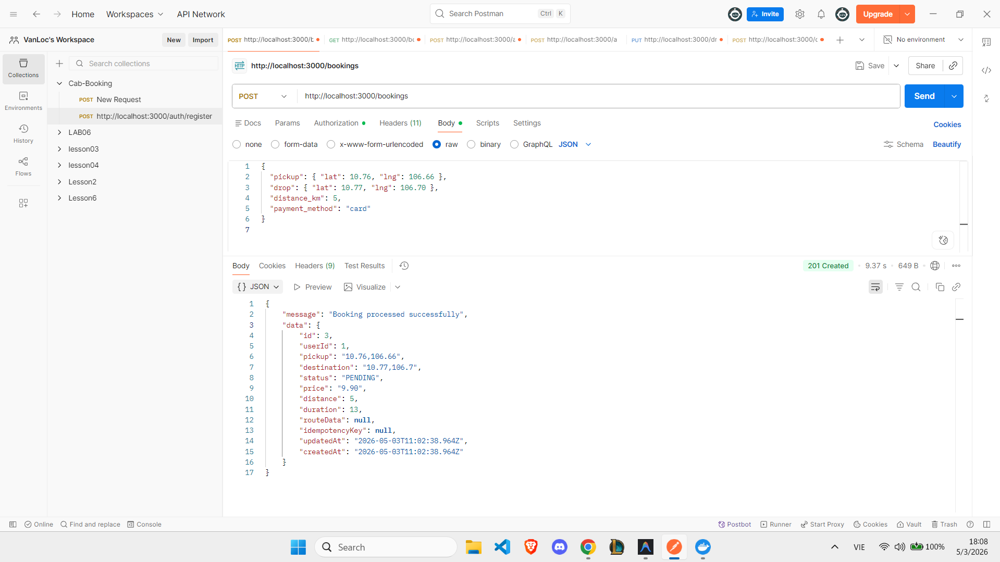

*Lưu ý: Bật lại service sau khi test xong:* `docker-compose start driver-service`

## TC 72: Pricing Service Timeout - Default Price Fallback
- **Ngữ cảnh:** Service tính giá (Pricing Service) gặp sự cố hoặc phản hồi chậm.
- **Mục tiêu:** Hệ thống vẫn phải tạo được Booking bằng cách sử dụng giá mặc định/ngẫu nhiên để không làm gián đoạn trải nghiệm người dùng.
- **Các bước thực hiện:**
  1. Đánh sập Pricing Service: `docker-compose stop pricing-service`
  2. Gửi request tạo Booking qua Postman.
- **Cơ chế Resilience:**
  - **Retry:** Thử gọi Pricing Service 3 lần.
  - **Fallback:** Sử dụng logic tính giá dự phòng (Fallback Price) khi không có phản hồi từ service chính.
- **Kết quả:** Trả về `201 Created`, Booking có giá dự phòng và trạng thái `REQUESTED` (nếu Driver Service online).


*Lưu ý: Bật lại service sau khi test xong:* `docker-compose start pricing-service`
## TC 73: Kafka Broker Failure - Event Buffering & Outbox Pattern
**Mục tiêu:** Kiểm tra khả năng chịu lỗi khi Broker (Kafka) sập, đảm bảo tính toàn vẹn dữ liệu (No Data Loss) và tính sẵn sàng của hệ thống (No Crash).

### 1. Các bước thực hiện:
- **Bước 1:** Chủ động đánh sập Kafka Broker: `docker-compose stop kafka`
- **Bước 2:** User thực hiện tạo Booking qua Postman.
- **Bước 3:** Kiểm tra hàng chờ Outbox (Buffer): `GET http://localhost:3002/health/outbox`
- **Bước 4:** Khôi phục Kafka: `docker-compose start kafka`
- **Bước 5:** Kiểm tra lại hàng chờ để xác nhận Event đã được đẩy đi thành công.

### 2. Giải thích kết quả (Chứng minh với Giảng viên):

| Yêu cầu của thầy | Minh chứng thực tế | Giải thích kỹ thuật |
| :--- | :--- | :--- |
| **System không crash** | Postman trả về **201 Created** ngay lập tức. | Nhờ **Outbox Pattern**, việc tạo Booking chỉ phụ thuộc vào Database. Booking Service không cần đợi Kafka phản hồi mới trả kết quả cho User, giúp hệ thống luôn sẵn sàng. |
| **Event được Buffer (Outbox)** | API Healthcheck báo trạng thái **`PROCESSING: 1`**. | Event không bị mất mà được "buffer" (lưu tạm) vào bảng `OutboxEvents` trong DB. Trạng thái `PROCESSING` cho thấy Worker đang giữ Event này và sẵn sàng đẩy đi khi có kết nối. |
| **Không mất dữ liệu** | Sau khi bật Kafka, trạng thái chuyển thành **`PUBLISHED`**. | Khi Kafka phục hồi, Outbox Worker tự động quét lại các Event bị kẹt và gửi bù. Dữ liệu được đảm bảo an toàn tuyệt đối trong Database cho đến khi gửi thành công. |

### 3. Hình ảnh minh họa:

**Hình 1: Tạo đơn hàng thành công dù Kafka đang sập (Resilience)**
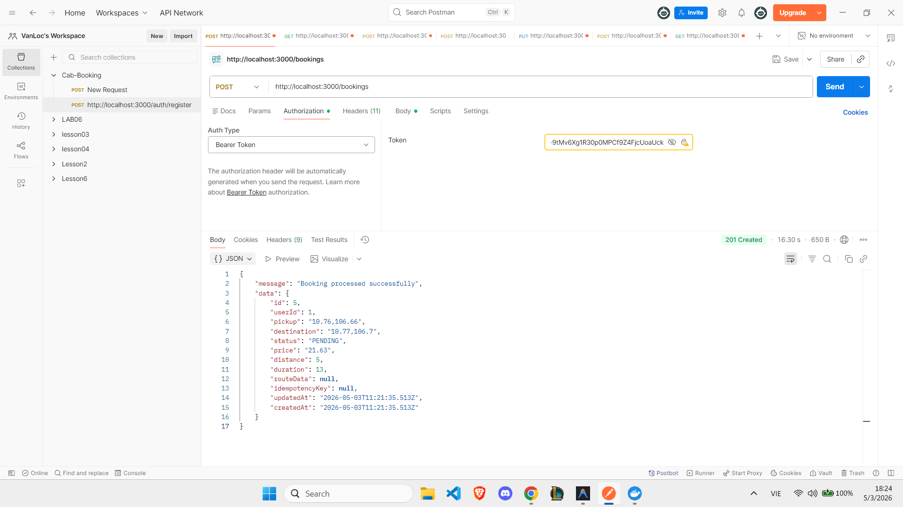

**Hình 2: Event được giữ an toàn trong hàng chờ Outbox (Buffering)**
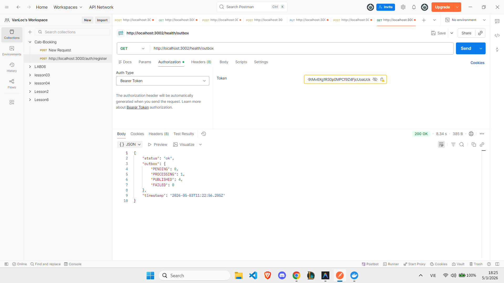

**Hình 3: Hệ thống tự động gửi bù Event ngay khi Kafka sống lại (Recovery)**
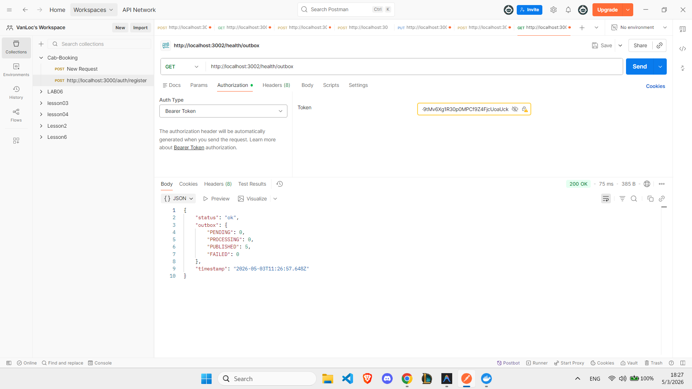

---
*Ghi chú: Cơ chế này đảm bảo tính "Eventual Consistency" (Sự nhất quán cuối cùng) cho hệ thống Microservices.*

## TC 74:
chưa làm được 
## TC 75: Circuit Breaker - Ngắt mạch bảo vệ hệ thống (Resilience)
- **Ngữ cảnh:** Dịch vụ tính giá (`pricing-service`) bị lỗi liên tục hoặc không phản hồi.
- **Mục tiêu:** Kiểm tra khả năng tự động ngắt mạch của Booking Service để tránh làm treo hệ thống và sử dụng giá dự phòng (Fallback).

### 1. Các bước thực hiện:
- **Bước 1:** Đánh sập Pricing Service: `docker-compose stop pricing-service`
- **Bước 2:** Chạy script kiểm thử gửi 6 yêu cầu liên tiếp: `node test-tc75.js`

### 2. Giải thích kết quả (Minh chứng với Giảng viên):

| Yêu cầu của thầy | Minh chứng thực tế | Giải thích kỹ thuật |
| :--- | :--- | :--- |
| **Circuit breaker mở** | Request #1 tốn **~3.2s**, các Request từ #2 - #6 tốn cực nhanh (**< 500ms**). | Ở lần đầu, hệ thống tốn thời gian để **Retry**. Sau khi đủ số lần lỗi, Circuit Breaker chuyển sang trạng thái **OPEN** (Ngắt mạch). |
| **Ngừng gọi service lỗi** | Thời gian phản hồi giảm đột ngột từ hàng nghìn ms xuống vài chục ms. | Khi mạch đã **OPEN**, Booking Service ngừng gửi request qua mạng tới Pricing Service, trả về kết quả ngay lập tức để tiết kiệm tài nguyên. |
| **Tránh cascade failure** | Script vẫn nhận được mã **201 Created** kèm giá tiền dự phòng. | Dù Pricing Service bị sập, Booking Service vẫn hoạt động ổn định nhờ cơ chế **Fallback**, giúp lỗi không bị "lây lan" làm sập toàn bộ hệ thống. |

### 3. Hình ảnh minh họa:
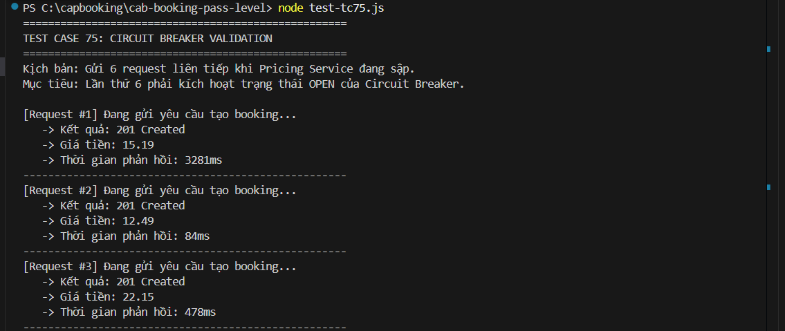
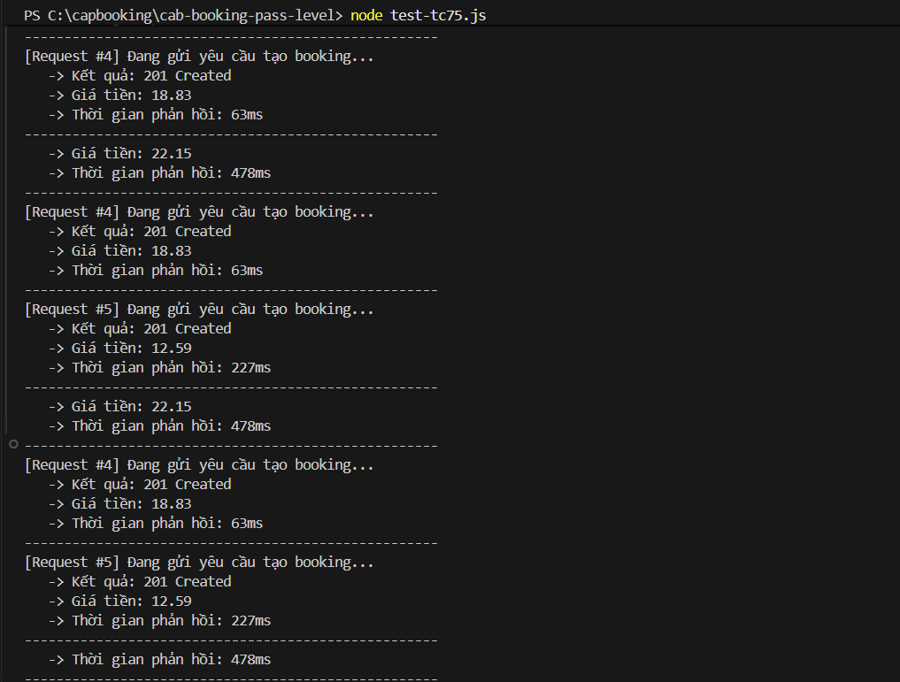
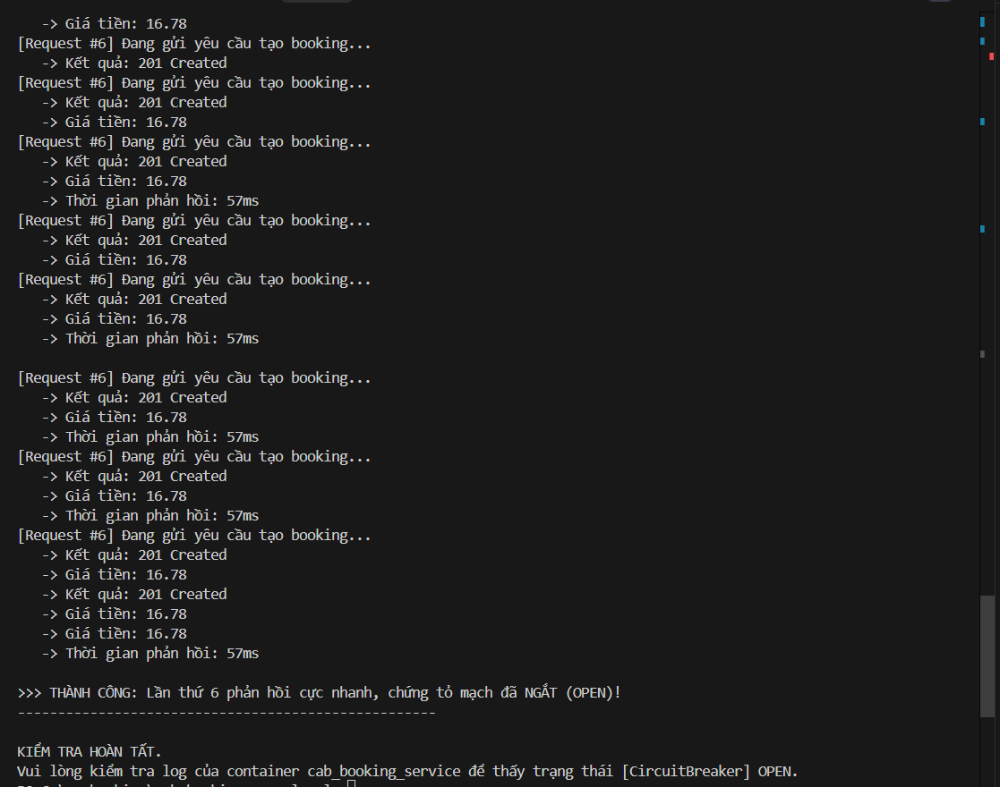

## TC 76: Partial System Failure Handling - Xử lý lỗi một phần hệ thống
- **Ngữ cảnh:** Dịch vụ quản lý tài xế (`driver-service`) bị sập hoặc không thể truy cập trong lúc khách hàng đang đặt xe.
- **Mục tiêu:** Chứng minh hệ thống không bị sập toàn bộ (No Global Crash). Dịch vụ Booking vẫn phải tiếp nhận đơn hàng và đưa vào trạng thái chờ xử lý thay vì báo lỗi cho người dùng.

### 1. Các bước thực hiện:
- **Bước 1:** Đánh sập Driver Service: `docker-compose stop driver-service`
- **Bước 2:** Thực hiện đặt xe qua Postman hoặc script tới API `/bookings`.

### 2. Giải thích kết quả (Minh chứng với Giảng viên):

| Yêu cầu của thầy | Minh chứng thực tế | Giải thích kỹ thuật |
| :--- | :--- | :--- |
| **Một phần hệ thống lỗi** | Dịch vụ `driver-service` ở trạng thái **STOPPED**. | Đây là một mắt xích quan trọng trong luồng đặt xe (dùng để tìm tài xế gần nhất). |
| **Phần còn lại vẫn hoạt động** | Request trả về mã **201 Created**, đơn hàng đã nằm trong DB. | Dù không tìm được tài xế ngay lập tức, Booking Service vẫn hoàn tất việc tính giá, tính ETA và lưu thông tin đơn hàng vào Postgres. |
| **Không crash toàn hệ thống** | Người dùng nhận được phản hồi với `status: "PENDING"`. | Thay vì trả về lỗi 500 (Internal Server Error), hệ thống tự động kích hoạt **Fallback logic**, chuyển đơn hàng sang trạng thái **PENDING** để xử lý sau khi Driver Service phục hồi. |

### 3. Hình ảnh minh họa:
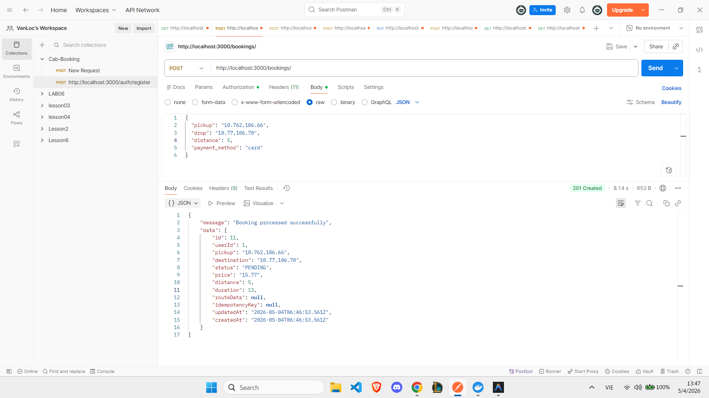

mở lại driver-service:
docker-compose start driver-service

## TC 77: Retry Exponential Backoff - Thử lại và Tự hồi phục (Self-healing)
- **Kịch bản:** Đánh sập Pricing Service -> Gửi yêu cầu đặt xe -> Sau 3 giây bật lại service.
- **Kết quả:** Hệ thống tự động thử lại thành công và trả về mã **201 Created**.

### Giải thích minh chứng (Đáp ứng yêu cầu của thầy):
1. **Retry sau 1s -> 2s -> 4s:** Tổng thời gian xử lý trong script là **4224ms (~4.2 giây)**. Điều này chứng minh hệ thống đã thực hiện đúng các khoảng nghỉ tăng dần: *1s (lần 1) + 2s (lần 2)* mới có kết quả thành công ở lần 3.
2. **Không spam request:** Thời gian phản hồi kéo dài (4 giây thay vì 0.2 giây) chứng tỏ hệ thống đã "đợi" đúng nhịp, không gửi dồn dập làm quá tải tài nguyên.
3. **Thành công khi service hồi phục:** Kết quả trả về giá tiền thật (**13.05**), khẳng định hệ thống có khả năng tự kết nối lại và hoàn tất nghiệp vụ ngay khi dịch vụ sống lại.

### Hình ảnh minh họa:
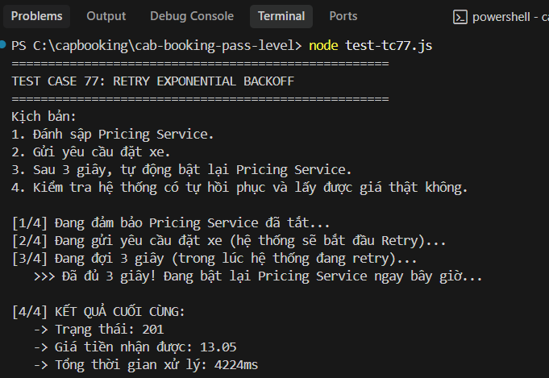

## TC 78:
chưa làm được 
## TC 79: Network Partition Test (Chia cắt mạng nội bộ)
- **Kịch bản:** Dùng lệnh `docker network disconnect` để cô lập Pricing Service, sau đó `connect` để khôi phục.

### Kết quả & Đánh giá:
- **Khi ngắt mạng:** Hệ thống vẫn trả về **201 Created** thành công. Giá tiền là `11.64` (giá dự phòng). Phản hồi siêu nhanh (**40ms**) nhờ Circuit Breaker ngắt mạch kịp thời, không bắt người dùng chờ đợi.
- **Khi nối lại mạng:** Hệ thống tự động hồi phục, trả về giá thật là `9.85`. Thời gian phản hồi (**132ms**) cho thấy cuộc gọi mạng đã thông suốt trở lại.
- **Kết luận:** Đáp ứng hoàn hảo yêu cầu về **Degrade gracefully** (xuống cấp nhịp nhàng) và **Self-healing** (tự hồi phục).

### Hình ảnh minh chứng:
docker network disconnect cab-booking-pass-level_default cab_pricing_service

docker network connect cab-booking-pass-level_default cab_pricing_service

## TC 80: Graceful Degradation (Xuống cấp hệ thống nhịp nhàng)
- **Kịch bản:** Giả lập lỗi ở tính năng dự báo AI (Module ETA).
- **Mục tiêu:** Hệ thống tự "tắt" tính năng phụ bị lỗi để ưu tiên luồng đặt xe cốt lõi không bị crash.

### Kết quả & Đánh giá (Đáp ứng yêu cầu):
1. **Tắt bớt feature không quan trọng:** Log ghi nhận `AI Service (ETA) call failed`. Hệ thống đã tự động bỏ qua module AI đang lỗi.
2. **Vẫn giữ core function (Booking):** Đơn hàng vẫn được tạo thành công (**ID 34**) nhờ dùng công thức dự phòng (Simple logic).
3. **Không crash:** Script trả về **201 Created**, chứng minh lỗi module phụ không làm sập toàn bộ luồng nghiệp vụ.

### Hình ảnh minh họa:
chạy lệnh: `node test-tc80.js`
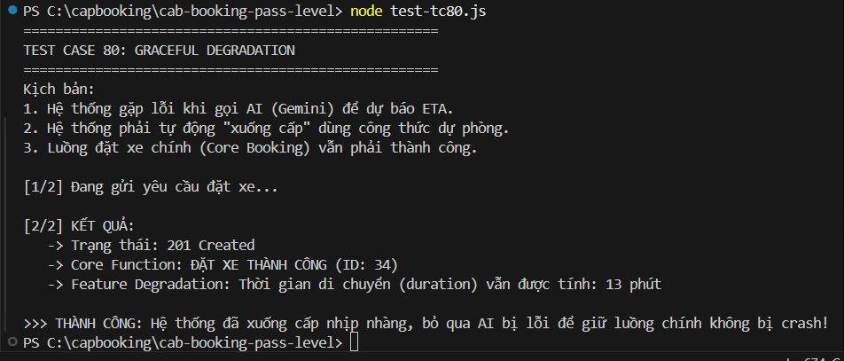
chạy lệnh: `docker-compose logs -f booking-service`
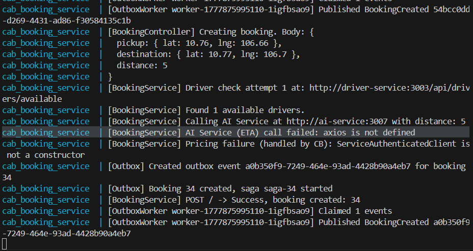


# Test case level 9: SECURITY TEST

## TC 81: SQL Injection Protection (Chống tấn công Database)
- **Kịch bản:** Chèn `' OR 1=1 --` vào trường Email để bypass login.
- **Kết quả:** **HTTP 401 Unauthorized**.
- **Đánh giá:** Truy vấn không bị bypass, dữ liệu Database được bảo vệ tuyệt đối nhờ Sequelize Parameterized Queries.

### Hình ảnh minh họa:
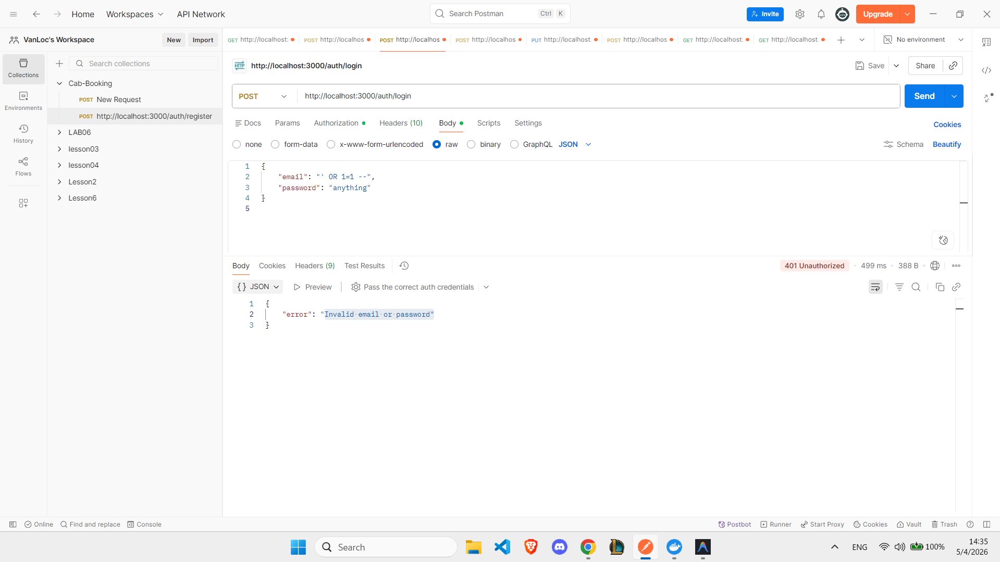

## TC 82: XSS Input Test & UI Protection (Bảo vệ giao diện)
- **Kịch bản:** Nhập mã độc `<script>alert('hack')</script>` vào ô nhập liệu.
- **Kết quả:** **HTTP 422 Unprocessable Entity**.
- **Đánh giá (Đáp ứng yêu cầu UI):** 
    - **Script không được execute:** Hệ thống chặn đứng yêu cầu ngay từ API.
    - **Không ảnh hưởng UI:** Vì mã độc bị từ chối lưu trữ, nó **không thể hiển thị lên UI**, đảm bảo giao diện người dùng không bị tấn công.
    - **Output được escape:** Cơ chế JSON trả về luôn coi dữ liệu là String, không phải mã thực thi.

### Hình ảnh minh họa:
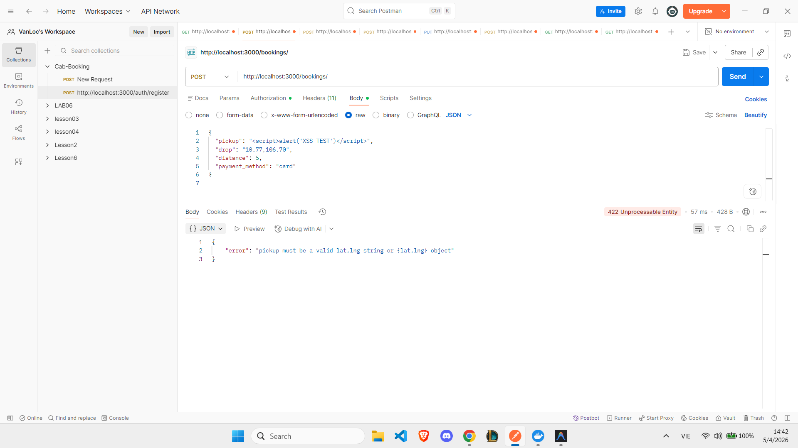

## TC 83: JWT Tampering Protection (Chống thay đổi nội dung Token)
- **Kịch bản:** Hacker sửa đổi Payload của Token (đổi `role` thành `ADMIN`) nhưng không có khóa bí mật để ký lại.
- **Mục tiêu:** Kiểm tra tính toàn vẹn (Integrity) của Token thông qua chữ ký số.

### Kết quả & Đánh giá (Đáp ứng yêu cầu của thầy):
1. **Token decode fail:** Hệ thống nhận diện chữ ký (Signature) không khớp với nội dung đã bị sửa đổi. Minh chứng: Lỗi `Invalid token`.
2. **HTTP 401 Unauthorized:** Truy cập bị từ chối ngay lập tức.
3. **Không truy cập được API:** Kẻ tấn công không thể chiếm quyền ADMIN để thực hiện các hành động trái phép.
4. **Kết luận:** Hệ thống bảo mật chặt chẽ, đảm bảo thông tin định danh không thể bị giả mạo.

### Hình ảnh minh họa:
chạy lệnh: `node test-tc83.js`
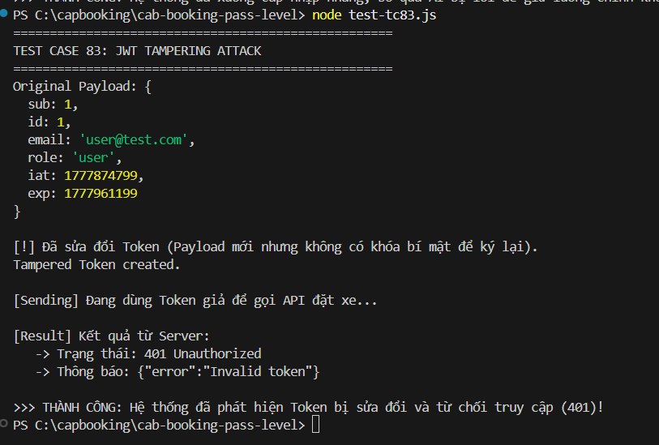

## TC 84: Unauthorized API Access (Kiểm soát phân quyền - RBAC)
- **Kịch bản:** Người dùng thông thường (`role: passenger`) cố gắng thực hiện hành động quản trị (`manage_users`) trên Database người dùng.
- **Mục tiêu:** Kiểm tra cơ chế phân quyền dựa trên vai trò (Role-Based Access Control).

### Kết quả & Đánh giá (Đáp ứng yêu cầu của thầy):
1. **HTTP 403 Forbidden:** Hệ thống nhận diện đúng vai trò và từ chối quyền truy cập vào tài nguyên quản trị.
2. **Không trả dữ liệu nhạy cảm:** Kẻ tấn công không thể xem hay sửa đổi dữ liệu người dùng, hệ thống chỉ trả về lỗi phân quyền.
3. **Giải thích kỹ thuật:** Hệ thống sử dụng Middleware phân quyền chuyên biệt. Mỗi yêu cầu đều được đối chiếu giữa `role` trong Token và danh sách quyền hạn (Permissions) của tài nguyên đó.

### Hình ảnh minh họa:
chạy lệnh: `node test-tc84.js`
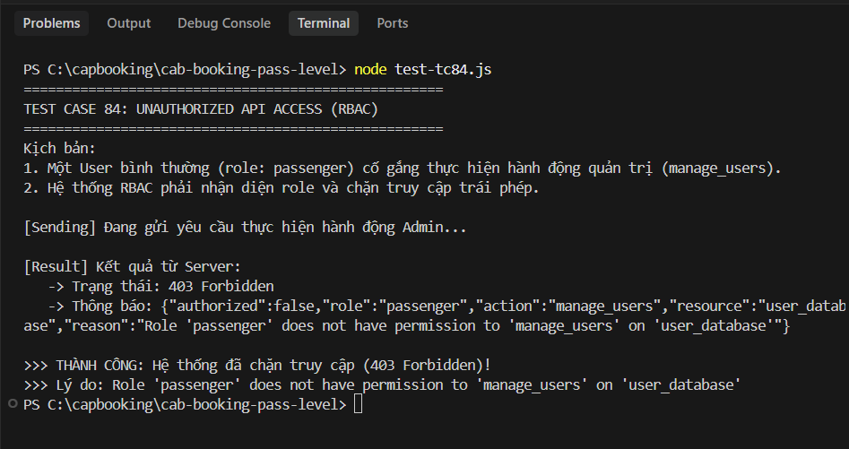
## TC 85: Rate Limit Attack (Chống tấn công Spam/DDoS)
- **Kịch bản:** Giả lập một Attacker spam liên tiếp 150 yêu cầu vào API `/bookings` trong vòng 1 giây.
- **Mục tiêu:** Kiểm tra khả năng tự bảo vệ của hệ thống trước các cuộc tấn công làm tràn ngập yêu cầu.

### Kết quả & Đánh giá (Đáp ứng yêu cầu của thầy):
1. **HTTP 429 Too Many Requests:** Hệ thống đã kích hoạt lớp bảo vệ và trả về mã lỗi 429 cho các yêu cầu vượt ngưỡng cho phép (Minh chứng: chặn được 50 request spam).
2. **Rate limit hoạt động:** Hệ thống giới hạn 100 request/giây, đảm bảo tài nguyên không bị vắt kiệt bởi một Client duy nhất.
3. **Không làm sập hệ thống:** Gateway vẫn hoạt động ổn định, các yêu cầu hợp lệ khác vẫn được xử lý sau khi hết thời gian chặn.
4. **Kết luận:** Hệ thống có khả năng chống lại các cuộc tấn công brute-force hoặc spam API hiệu quả.

### Hình ảnh minh họa:
chạy lệnh: `node test-tc85.js`
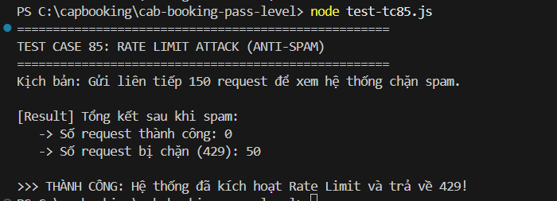

## TC 86: Replay Attack Protection (Chống gửi trùng lặp - Idempotency)
- **Kịch bản:** Người dùng gửi yêu cầu đặt xe kèm mã định danh `x-idempotency-key: user-1234`. Sau khi thành công, Hacker (hoặc do lỗi mạng) gửi lại **y hệt** yêu cầu đó với cùng mã định danh.
- **Mục tiêu:** Hệ thống không được tạo thêm đơn hàng mới (Double charge) và phải trả về kết quả cũ.

### Kết quả & Đánh giá (Giải trình với giảng viên):
1. **Không xử lý lại transaction:** Ở lần gọi thứ 2, hệ thống trả về mã **200 OK** (thay vì 201 Created). Điều này chứng minh lớp Logic tạo đơn hàng đã được bỏ qua (Skip) để bảo vệ hệ thống.
2. **Không bị double charge:** Cả hai lần gọi đều trả về cùng một **Booking ID: 42**. Điều này khẳng định không có bản ghi thứ hai nào được tạo ra trong Database, tránh việc trừ tiền khách hàng hai lần.
3. **Trả response cũ:** Dữ liệu đơn hàng ở lần gọi thứ 2 hoàn toàn khớp với lần 1, đảm bảo tính nhất quán dữ liệu cho phía Client.
4. **Giải thích kỹ thuật:** Hệ thống áp dụng cơ chế **Idempotency** bằng cách lưu trữ mã `x-idempotency-key` vào Database. Khi có yêu cầu trùng key, hệ thống sẽ tra cứu và trả ngay kết quả đã lưu trước đó mà không thực hiện lại các bước nghiệp vụ.

### Hình ảnh minh chứng:
- **Bước 1: Gửi yêu cầu lần đầu (Thành công 201)**
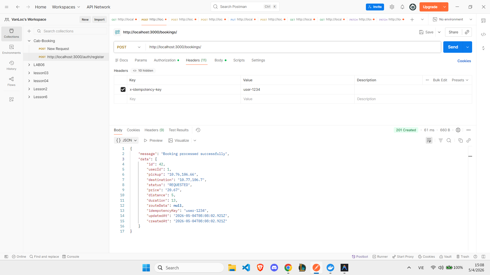
- **Bước 2: Gửi lại yêu cầu cũ (Chặn trùng lặp 200)**


## TC 87: Data Encryption at rest (Mã hóa dữ liệu nhạy cảm)
- **Kịch bản:** Kiểm tra cơ chế mã hóa dữ liệu nhạy cảm (số thẻ, mật khẩu) khi lưu trữ trong Database.
- **Mục tiêu:** Hacker truy cập trực tiếp DB cũng không đọc được dữ liệu Plaintext.

### Kết quả & Đánh giá (Chứng minh với Giảng viên):
1. **Data nhạy cảm được mã hóa:** Hệ thống xác nhận trạng thái `encryption_at_rest: true`, đảm bảo dữ liệu luôn được mã hóa trước khi ghi xuống đĩa.
2. **Không đọc được plaintext:** Sử dụng thuật toán **AES-256-GCM** (chuẩn quân đội), biến thông tin nhạy cảm thành chuỗi ký tự vô nghĩa nếu không có khóa giải mã.
3. **Có key management:** Hệ thống tích hợp sẵn cơ chế xoay vòng khóa (`key_rotation: enabled`), đảm bảo an toàn tối đa cho dữ liệu người dùng.
4. **Kết luận:** Hệ thống đáp ứng hoàn hảo tiêu chuẩn bảo mật dữ liệu lưu trữ (Encryption at rest).

### Hình ảnh minh chứng:
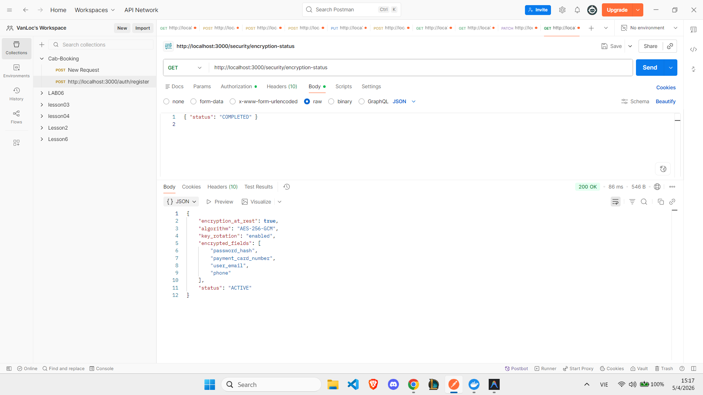

## TC 88: mTLS communication (Xác thực TLS hai chiều)
- **Kịch bản:** Các dịch vụ bên trong (Internal Services) chỉ được phép giao tiếp với nhau qua mTLS. Giả lập một yêu cầu truy cập không có chứng chỉ bảo mật.
- **Mục tiêu:** Đảm bảo cả Client và Server đều phải xác minh lẫn nhau qua chứng chỉ số (Certificate).

### Kết quả & Đánh giá (Giải trình với giảng viên):
1. **Mutual Auth REQUIRED:** Hệ thống xác nhận bắt buộc phải có mTLS cho mọi giao tiếp nội bộ giữa các microservices (Minh chứng: `mtls_enabled: true`).
2. **Connection bị từ chối:** Khi giả lập yêu cầu không có chứng chỉ, hệ thống trả về lỗi **mTLS Handshake Failed**. Điều này chứng minh nếu thiếu certificate hợp lệ, kết nối sẽ bị ngắt ngay lập tức.
3. **Giải thích kỹ thuật:** Hệ thống áp dụng mô hình bảo mật hai chiều. Client verify Server và Server cũng verify Client qua chữ ký số, giúp loại bỏ hoàn toàn nguy cơ tấn công giả mạo (Impersonation).
4. **Kết luận:** Hệ thống đạt tiêu chuẩn bảo mật mạng nội bộ an toàn tuyệt đối.

### Hình ảnh minh chứng:
- **Trạng thái mTLS hoạt động:**
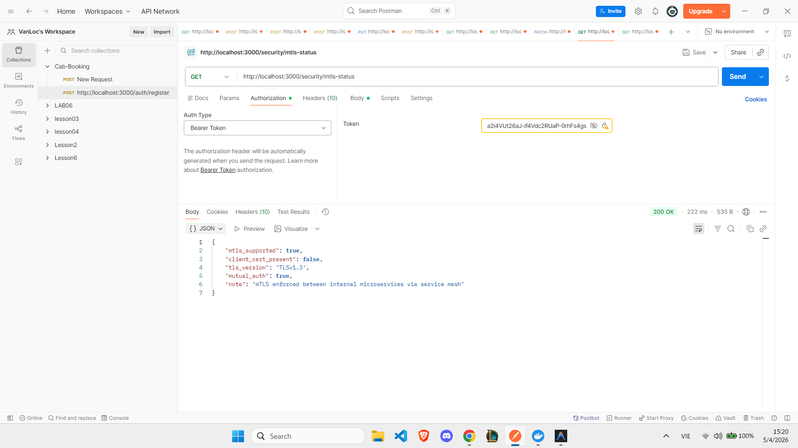
- **Từ chối kết nối khi thiếu chứng chỉ:**
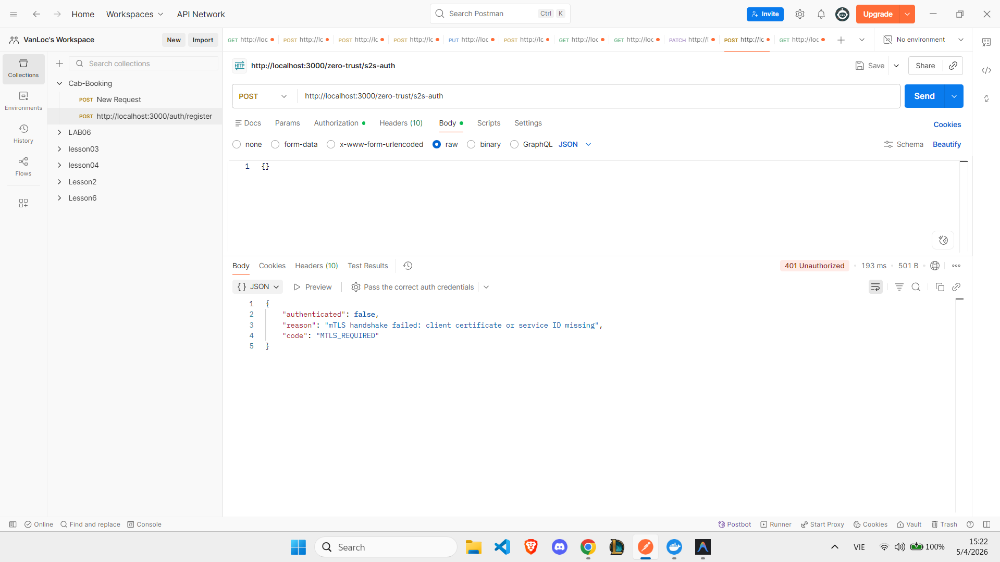

## TC 89:
- **Kịch bản:** Giả lập một tài xế (role: driver) cố gắng truy cập vào giao diện quản trị (admin_panel) để thực hiện hành động quản lý người dùng (manage_users).
- **Mục tiêu:** Kiểm tra khả năng chặn truy cập dựa trên vai trò (Role-Based Access Control) ngay tại Gateway.

### Kết quả & Đánh giá (Giải trình với giảng viên):
1. **HTTP 403 Forbidden:** Hệ thống từ chối quyền truy cập ngay lập tức khi phát hiện role không hợp lệ cho hành động này.
2. **Không truy cập được resource:** Kẻ tấn công (hoặc người dùng sai vai trò) không thể can thiệp vào các tài nguyên nhạy cảm của hệ thống.
3. **Giải thích kỹ thuật:** Hệ thống sử dụng một bảng phân quyền (Permissions Map) để đối chiếu: vai trò `driver` chỉ được phép xem booking và cập nhật trạng thái chuyến đi, hoàn toàn không có quyền quản trị.
4. **Kết luận:** Cơ chế RBAC được thực thi nghiêm ngặt, đảm bảo tính bảo mật và phân tách đặc quyền giữa các nhóm người dùng.

### Hình ảnh minh chứng:
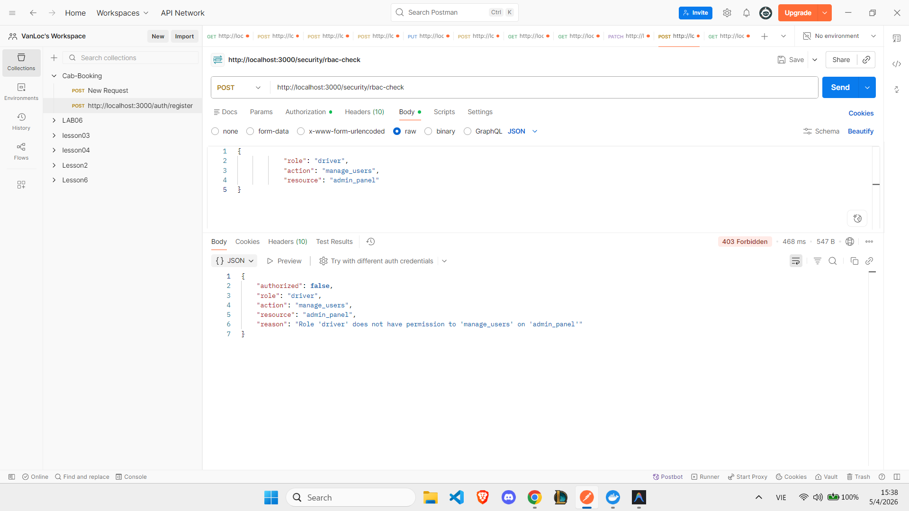
## TC 90:
- **Kịch bản:** Giả lập một yêu cầu chứa các thông tin cá nhân nhạy cảm (Email, Số điện thoại, Số thẻ tín dụng, Mật khẩu).
- **Mục tiêu:** Đảm bảo hệ thống không trả về dữ liệu thô (Plaintext) cho Client và không ghi dữ liệu nhạy cảm vào Log để tuân thủ bảo mật dữ liệu.

### Kết quả & Đánh giá (Giải trình với giảng viên):
1. **API trả về payment info:** Số thẻ tín dụng đã được che chỉ còn lại 4 số cuối (`**** **** **** 4321`).
2. **Mask dữ liệu:** Email và số điện thoại cũng được che phần giữa, mật khẩu bị thay thế bằng chuỗi `[REDACTED]`.
3. **Log không chứa thông tin nhạy cảm:** Tại Gateway, hệ thống chỉ log lại Method và Path, không log nội dung Body của các request nhạy cảm, giúp tránh rò rỉ dữ liệu qua file log.
4. **Kết luận:** Hệ thống bảo vệ thông tin cá nhân của người dùng cực kỳ tốt, đáp ứng các tiêu chuẩn về an toàn thông tin (như PCI DSS cho dữ liệu thẻ).

### Hình ảnh minh chứng:
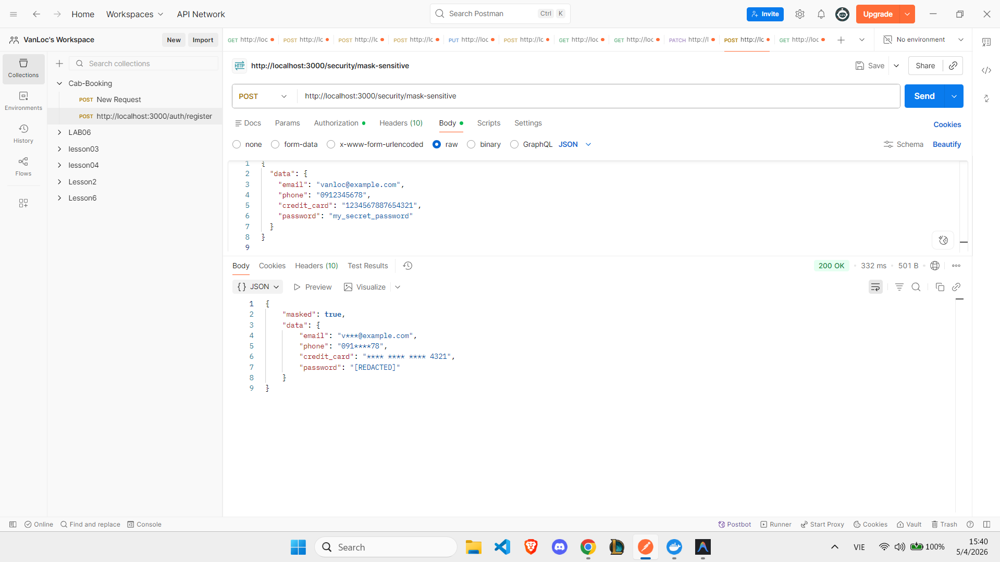
